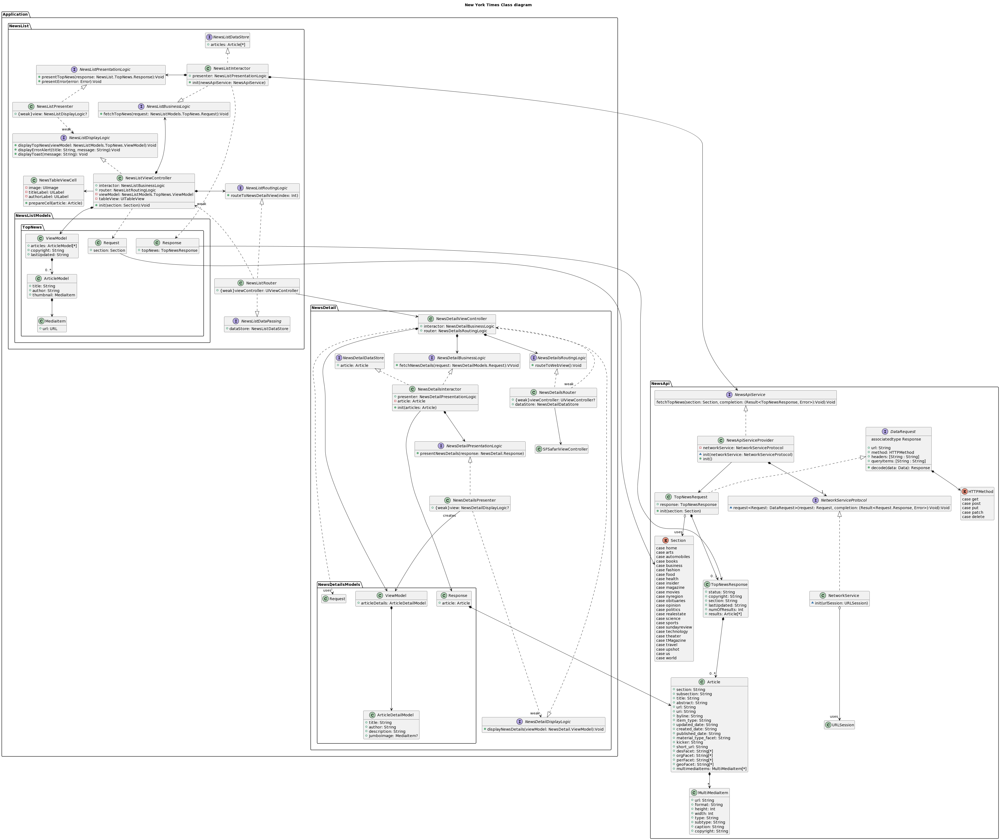
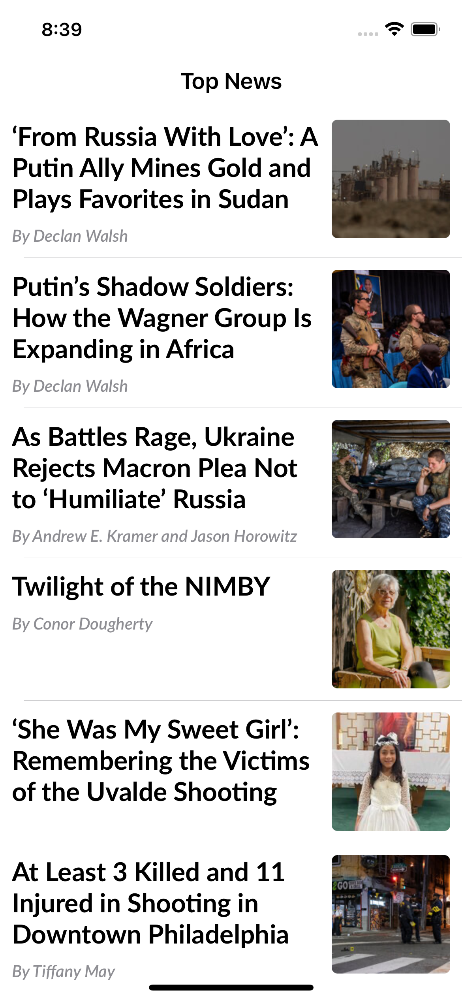

# NYTimesNews

## Summary

Shows Top news from New York Times server

## Design

### Architecture

Clean Swift architecture is chosen for the view implementations. It enables the clean separation between view logic, business logic, presentation logic, and routing logic. All the classes in this deisgn are loosely coupled. It is easier to maintain.

### Apple Human Interface guidelines

- Accessbility support
- Support for DarkMode and Light Mode
- Dynamic Font size
- Portriate and Landscape modes are supported

### Detailed Class diagram

## Screenshots

## Thirdparty Depndencies

| Name | Repository |
| --- | --- |
| SDWebImage | <https://github.com/SDWebImage/SDWebImage> |
| MBProgressHUD | <https://github.com/jdg/MBProgressHUD> |
| Reachability | <https://github.com/ashleymills/Reachability.swift> |

## Validation

Unit tests are covered the NewsList and NewsDetails classes and also NYTimesNewsApi framework classes.
